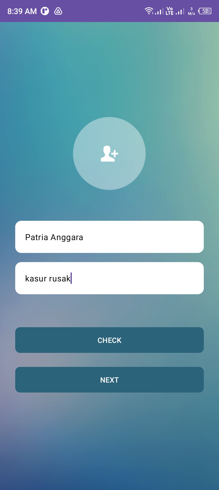
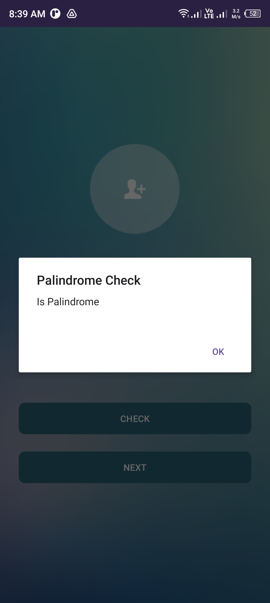
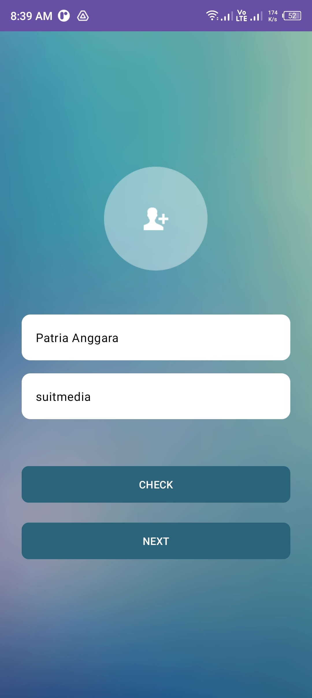
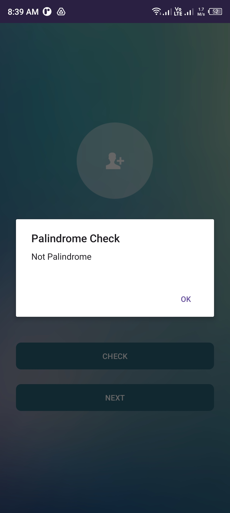
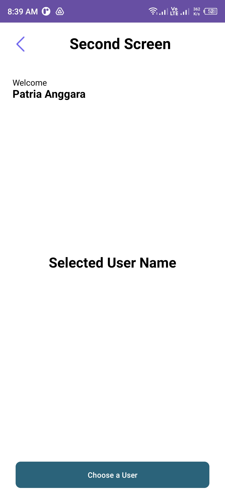
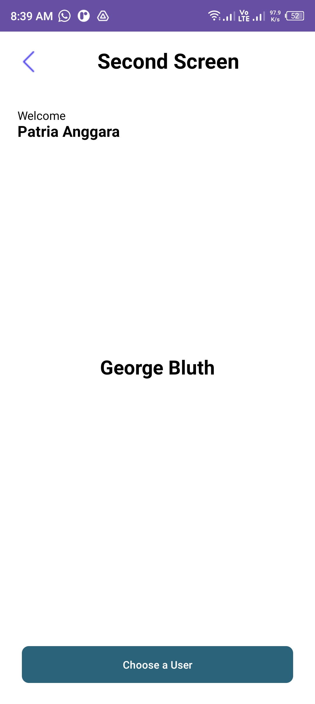
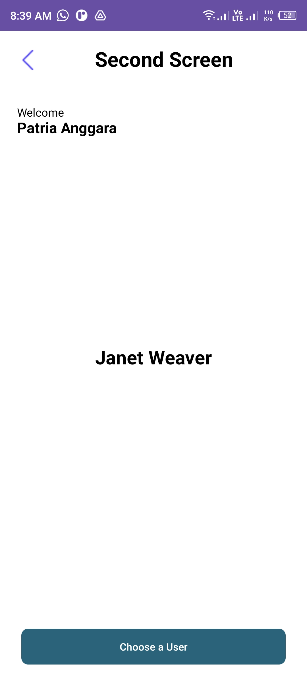
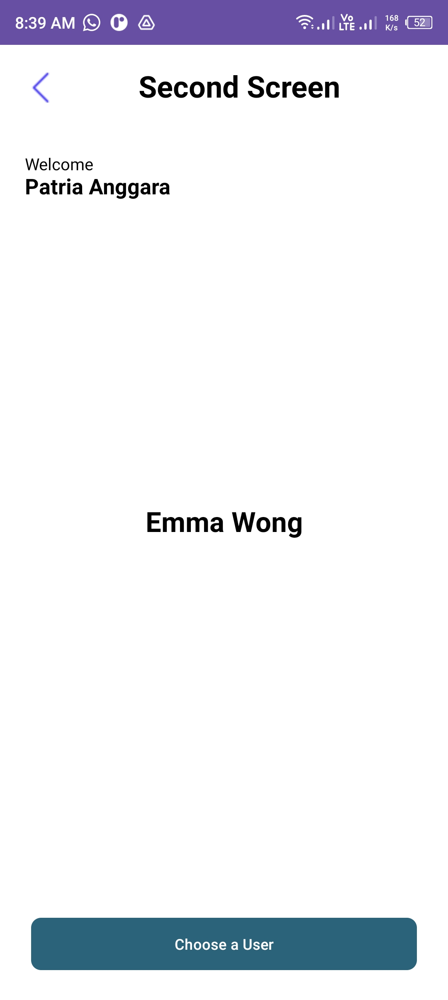
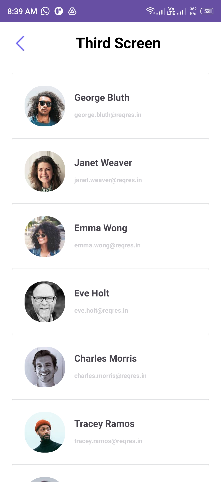

## APK File: <a href="https://github.com/patriciaanggraeni/suitmedia-android-developer-test/blob/main/app/src/main/java/com/example/suitmedia_android_developer_test/apk/app-debug.apk">download</a>

## Screenshot App

### ========== First Screen
<table>
    <thead>
        <tr>
            <th>Input Field</th>
            <th>Validation</th>
        </tr>
    </thead>
    <tbody>
        <tr>
            <td>
                
            </td>
            <td>
                
            </td>
        </tr>
        <tr>
            <td>
                
            </td>
            <td>
                
            </td>
        </tr>
    </tbody>
</table>

### ========== Second Screen
<table>
    <tbody>
        <tr>
            <td>
                
            </td>
            <td>
                
            </td>
        </tr>
        <tr>
            <td>
                
            </td>
            <td>
                
            </td>
        </tr>
    </tbody>
</table>

### ========== Third Screen
<table>
    <thead>
        <tr>
            <th>List User</th>
        </tr>
    </thead>
    <tbody>
        <tr>
            <td>
                
            </td>
        </tr>
    </tbody>
</table>

### ========== Demo App
<table>
    <thead>
        <tr>
            <th>Demo Application</th>
        </tr>
    </thead>
    <tbody>
        <tr>
            <td>
                
            </td>
        </tr>
    </tbody>
</table>